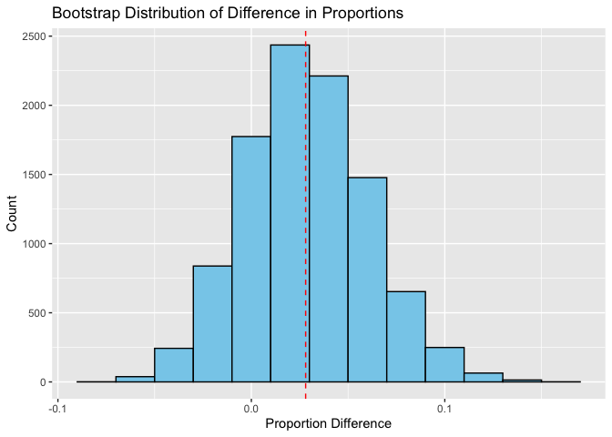

Lab 11 - Smoking during pregnancy
================
Yuxin Xie
3.10.25

### Load packages and data

In 2004, North Carolina released a comprehensive birth record dataset
that holds valuable insights for researchers examining the connection
between expectant mothers’ habits and practices and their child’s birth.
In this lab, we’ll be exploring a randomly selected subset of the data.
You’ll learn how to use non-parametric-based inference to analyze the
impact of maternal smoking during pregnancy on the weight of the baby.
You will also explore the relationships between other variables, such as
the mother’s age and the baby’s birth weight. Through the exercises, you
will practice data manipulation, visualization, hypothesis testing, and
calculating confidence intervals. You can find the lab here

``` r
library(tidyverse) 
library(tidymodels)
library(openintro)

library(infer)
```

In this lab, we’ll be generating random samples. To make sure our
results stay consistent, make sure to set a seed before you dive into
the sampling process. Otherwise, the data will change each time you knit
your lab. To set your seed, simply find the designated R chunk in your R
Markdown file and insert the seed value there.

``` r
data(ncbirths)
#We have observations on 13 different variables, some categorical and some numerical. 
```

Before analyzing any new dataset, it’s important to get to know your
data. Start by summarizing the variables and determining if their data
type. Are they categorical? Are they numerical? For numerical variables,
check for outliers.

### Exercise 1

What are the cases in this data set? How many cases are there in our
sample? Each case (or observation) in the ncbirths dataset represents a
single birth record from North Carolina. Each row corresponds to one
baby and contains details about the baby, the mother, and
pregnancy-related factors. There are 1000 obs in the dataset.

\###84.2.1 Baby weights \### 2

``` r
ncbirths_white <- ncbirths %>%
  filter(whitemom == "white")
#714 obs
mean_weight_white <- mean(ncbirths_white$weight, na.rm = TRUE)
mean_weight_white
```

    ## [1] 7.250462

### 3

To conduct simulation-based inference, each birth record should be
independent. Since this dataset represents a randomly selected subset,
we can reasonably assume independence. 1000 obs is a large sample size.
based on the graph, the distribution is slightly skewed but not extreme.

``` r
ggplot(ncbirths, aes(x = weight)) +
  geom_histogram(binwidth = 0.5, fill = "skyblue", color = "black") +
  labs(title = "Distribution of Birth Weights", x = "Birth Weight", y = "Count")
```

<!-- --> Let’s discuss
how this test would work. Our goal is to simulate a null distribution of
sample means that is centered at the null value of 7.43 pounds. In order
to do so, we: - take a bootstrap sample of from the original sample, -
calculate this bootstrap sample’s mean, - repeat these two steps a large
number of times to create a bootstrap distribution of means centered at
the observed sample mean, - shift this distribution to be centered at
the null value by subtracting / adding X to all bootstrap mean (X =
difference between mean of bootstrap distribution and null value), and -
calculate the p-value as the proportion of bootstrap samples that
yielded a sample mean at least as extreme as the observed sample mean.

### 4

``` r
# set a seed
set.seed(1234)

# Generate 10000 bootstrap samples
boot_df <- ncbirths_white %>%
  specify(response = weight) %>% 
  generate(reps = 10000, type = "bootstrap") %>% 
  calculate(stat = "mean")

obs_mean<-mean (boot_df$stat)

# Plot bootstrap distribution of means
ggplot(data = boot_df, mapping = aes(x = stat)) +
  geom_histogram(binwidth = 0.1, fill = "skyblue", color = "black") +
  labs(title = "Bootstrap Distribution of Means",
       x = "Sample Mean Birth Weight (lbs)",
       y = "Count")
```

<!-- -->

``` r
boot_df %>%
  summarize(lower = quantile(stat, 0.025),
            upper = quantile(stat, 0.975))
```

    ## # A tibble: 1 × 2
    ##   lower upper
    ##   <dbl> <dbl>
    ## 1  7.15  7.35

``` r
# Generate the null distribution centered at 7.43 pounds
null_dist <- ncbirths_white %>%
  specify(response = weight) %>%
  hypothesize(null = "point", mu = 7.43) %>%
  generate(reps = 10000, type = "bootstrap") %>%
  calculate(stat = "mean")

# Visualize the null distribution
ggplot(data = null_dist, mapping = aes(x = stat)) +
  geom_histogram(binwidth = 0.1, fill = "skyblue", color = "black") +
  geom_vline(xintercept = 7.43, color = "red", linetype = "dashed") +
  labs(title = "Null Distribution of Birth Weights",
       x = "Sample Mean Birth Weight (lbs)",
       y = "Count")
```

<!-- -->

``` r
p_value <- null_dist %>%
  filter(abs(stat - 7.43) >= abs(obs_mean - 7.43)) %>%
  summarize(p_value = n()/nrow(null_dist)) %>%
  pull(p_value)

# Print p-value
p_value
```

    ## [1] 6e-04

``` r
#p-value = 6e−04=0.0006 < 0.05, reject the null hypothesis, birth weight has changed significantly since 1995.
```

### 5

``` r
ggplot(ncbirths, aes(x = habit, y = weight, fill = habit)) +
  geom_boxplot() +
  labs(title = "Birth Weight by Mother's Smoking Habit",
       x = "Smoking Habit",
       y = "Birth Weight (lbs)") +
  theme_minimal()
```

<!-- -->

### 6

``` r
ncbirths_clean <- ncbirths %>%
  drop_na(habit, weight)

ggplot(ncbirths_clean, aes(x = habit, y = weight, fill = habit)) +
  geom_boxplot() +
  labs(title = "Birth Weight by Mother's Smoking Habit",
       x = "Smoking Habit",
       y = "Birth Weight (lbs)") +
  theme_minimal()
```

<!-- -->

### 7

``` r
ncbirths_clean %>%
  group_by(habit) %>%
  summarize(mean_weight = mean(weight))
```

    ## # A tibble: 2 × 2
    ##   habit     mean_weight
    ##   <fct>           <dbl>
    ## 1 nonsmoker        7.14
    ## 2 smoker           6.83

``` r
#We can see that there’s an observable difference, but is this difference meaningful? Is it statistically significant? We can answer this question by conducting a hypothesis test.
```

### 8

Write the hypotheses for testing if the average weights of babies born
to smoking and non-smoking mothers are different.

H0: There is no difference in the average birth weights between babies
born to smoking and non-smoking mothers (μ1=μ2) H1: There is a
difference in the average birth weights between the two groups (μ1≠μ2)

### 9

``` r
# set a seed
set.seed(12345)

# Generate 10000 bootstrap samples
boot_df2 <- ncbirths_clean %>%
  specify(response = weight, explanatory = habit) %>%  
  generate(reps = 10000, type = "bootstrap") %>% 
  calculate(stat = "diff in means", order = c("nonsmoker", "smoker"))

obs_diff <- ncbirths_clean %>%
  group_by(habit) %>%
  summarize(mean_weight = mean(weight, na.rm = TRUE)) %>%
  spread(habit, mean_weight) %>%
  mutate(obs_diff = nonsmoker - smoker) %>%
  pull(obs_diff)

ggplot(data = boot_df2, mapping = aes(x = stat)) +
  geom_histogram(binwidth = 0.05, fill = "skyblue", color = "black") +
  labs(title = "Bootstrap Distribution of Mean Differences",
       x = "Mean Birth Weight Difference (Nonsmoker - Smoker)",
       y = "Count")
```

<!-- -->

``` r
boot_df2 %>%
  summarize(lower = quantile(stat, 0.025),
            upper = quantile(stat, 0.975))
```

    ## # A tibble: 1 × 2
    ##    lower upper
    ##    <dbl> <dbl>
    ## 1 0.0560 0.578

``` r
null_dist <- ncbirths_clean %>%
  specify(response = weight, explanatory = habit) %>%
  hypothesize(null = "independence") %>%
  generate(reps = 10000, type = "permute") %>%
  calculate(stat = "diff in means", order = c("nonsmoker", "smoker"))

ggplot(data = null_dist, mapping = aes(x = stat)) +
  geom_histogram(binwidth = 0.05, fill = "skyblue", color = "black") +
  geom_vline(xintercept = obs_diff, color = "red", linetype = "dashed") +
  labs(title = "Null Distribution of Mean Differences",
       x = "Mean Birth Weight Difference (Nonsmoker - Smoker)",
       y = "Count")
```

<!-- -->

``` r
p_value <- null_dist %>%
  filter(abs(stat) >= abs(obs_diff)) %>%
  summarize(p_value = n() / nrow(null_dist)) %>%
  pull(p_value)

# Print p-value
p_value
```

    ## [1] 0.0263

``` r
#p-value = 0.0263 < 0.05, reject the null hypothesis, meaning there is a significant difference in birth weights between smokers and nonsmokers.
```

### 10

``` r
# Calculate 95% confidence interval
conf_interval <- boot_df2 %>%
  summarize(lower = quantile(stat, 0.025),
            upper = quantile(stat, 0.975))

# Print the confidence interval
conf_interval
```

    ## # A tibble: 1 × 2
    ##    lower upper
    ##    <dbl> <dbl>
    ## 1 0.0560 0.578

``` r
# The 95% confidence interval (CI) for the difference in mean birth weights between babies born to nonsmoking and smoking mothers is: (0.056,0.578)
# The interval does not include 0
```

### 11

``` r
# Filter for younger and mature mothers while dropping NA values
younger_moms <- ncbirths %>%
  filter(mature == "younger mom") %>%
  drop_na(mage)

mature_moms <- ncbirths %>%
  filter(mature == "mature mom") %>%
  drop_na(mage)


summary (younger_moms)
```

    ##       fage            mage               mature        weeks      
    ##  Min.   :14.00   Min.   :13.00   mature mom :  0   Min.   :22.00  
    ##  1st Qu.:24.00   1st Qu.:21.00   younger mom:867   1st Qu.:37.00  
    ##  Median :29.00   Median :25.00                     Median :39.00  
    ##  Mean   :28.86   Mean   :25.44                     Mean   :38.38  
    ##  3rd Qu.:33.00   3rd Qu.:30.00                     3rd Qu.:40.00  
    ##  Max.   :48.00   Max.   :34.00                     Max.   :45.00  
    ##  NA's   :160                                       NA's   :1      
    ##        premie        visits             marital        gained     
    ##  full term:737   Min.   : 0.00   not married:361   Min.   : 0.00  
    ##  premie   :129   1st Qu.:10.00   married    :506   1st Qu.:21.00  
    ##  NA's     :  1   Median :12.00                     Median :30.00  
    ##                  Mean   :12.03                     Mean   :30.56  
    ##                  3rd Qu.:15.00                     3rd Qu.:38.25  
    ##                  Max.   :30.00                     Max.   :85.00  
    ##                  NA's   :7                         NA's   :23     
    ##      weight       lowbirthweight    gender          habit          whitemom  
    ##  Min.   : 1.000   low    : 93    female:435   nonsmoker:752   not white:255  
    ##  1st Qu.: 6.380   not low:774    male  :432   smoker   :115   white    :611  
    ##  Median : 7.310                                               NA's     :  1  
    ##  Mean   : 7.097                                                              
    ##  3rd Qu.: 8.000                                                              
    ##  Max.   :11.750                                                              
    ## 

``` r
summary (mature_moms)
```

    ##       fage            mage               mature        weeks      
    ##  Min.   :26.00   Min.   :35.00   mature mom :133   Min.   :20.00  
    ##  1st Qu.:35.00   1st Qu.:35.00   younger mom:  0   1st Qu.:38.00  
    ##  Median :38.00   Median :37.00                     Median :39.00  
    ##  Mean   :38.36   Mean   :37.18                     Mean   :38.02  
    ##  3rd Qu.:41.00   3rd Qu.:38.00                     3rd Qu.:40.00  
    ##  Max.   :55.00   Max.   :50.00                     Max.   :44.00  
    ##  NA's   :11                                        NA's   :1      
    ##        premie        visits             marital        gained     
    ##  full term:109   Min.   : 3.00   not married: 25   Min.   : 0.00  
    ##  premie   : 23   1st Qu.:10.00   married    :107   1st Qu.:20.00  
    ##  NA's     :  1   Median :12.00   NA's       :  1   Median :28.00  
    ##                  Mean   :12.61                     Mean   :28.79  
    ##                  3rd Qu.:15.00                     3rd Qu.:36.00  
    ##                  Max.   :30.00                     Max.   :70.00  
    ##                  NA's   :2                         NA's   :4      
    ##      weight       lowbirthweight    gender         habit          whitemom  
    ##  Min.   : 1.380   low    : 18    female:68   nonsmoker:121   not white: 29  
    ##  1st Qu.: 6.380   not low:115    male  :65   smoker   : 11   white    :103  
    ##  Median : 7.310                              NA's     :  1   NA's     :  1  
    ##  Mean   : 7.126                                                             
    ##  3rd Qu.: 8.190                                                             
    ##  Max.   :10.250                                                             
    ## 

``` r
# in the younger mom group, min = 13, max = 34 
# in the mature mom group, min = 35, max = 50 
```

### 12

Null Hypothesis (H₀): The proportion of low birth weight babies is not
higher for mature mothers. Alternative Hypothesis (Hₐ): The proportion
of low birth weight babies is higher for mature mothers. This is a
one-tailed test Each birth is an independent observation. Sample Size is
large.

``` r
table(ncbirths$mature, ncbirths$lowbirthweight)
```

    ##              
    ##               low not low
    ##   mature mom   18     115
    ##   younger mom  93     774

``` r
set.seed(123456)

ncbirths_clean2 <- ncbirths %>%
  drop_na(mature, weight)

# Generate 10000 bootstrap samples
boot_prop <- ncbirths_clean2 %>%
  specify(
    response = lowbirthweight, 
    explanatory = mature, 
    success = "low"  # Focus on "low" birth weight
  ) %>%  
  generate(reps = 10000, type = "bootstrap") %>% 
  calculate(
    stat = "diff in props", 
    order = c("mature mom","younger mom")  )
    

obs_diff <- ncbirths_clean2 %>%
  specify(
    response = lowbirthweight, 
    explanatory = mature, 
    success = "low"
  ) %>% 
  calculate(
    stat = "diff in props", 
    order = c("mature mom","younger mom")
  ) %>% 
  pull(stat)

ggplot(boot_prop, aes(x = stat)) +
  geom_histogram(binwidth = 0.02, fill = "skyblue", color = "black") +
  geom_vline(xintercept = obs_diff, color = "red", linetype = "dashed") +
  labs(
    title = "Bootstrap Distribution of Difference in Proportions",
    x = "Proportion Difference",
    y = "Count"
  )
```

<!-- -->

``` r
boot_prop %>% 
  summarize(lower = quantile(stat, 0.05)) 
```

    ## # A tibble: 1 × 1
    ##     lower
    ##     <dbl>
    ## 1 -0.0227

``` r
null_dist <- ncbirths_clean2 %>%
  specify(
    response = lowbirthweight, 
    explanatory = mature, 
    success = "low"
  ) %>%
  hypothesize(null = "independence") %>%
  generate(reps = 10000, type = "permute") %>%
  calculate(
    stat = "diff in props", 
    order = c("mature mom","younger mom")
  )

ggplot(null_dist, aes(x = stat)) +
  geom_histogram(binwidth = 0.02, fill = "skyblue", color = "black") +
  geom_vline(xintercept = obs_diff, color = "red", linetype = "dashed") +
  labs(
    title = "Null Distribution of Difference in Proportions",
    x = "Proportion Difference",
    y = "Count"
  )
```

<!-- -->

``` r
p_value <- null_dist %>%
  filter(stat >= obs_diff) %>%  # Extreme values under H₁
  summarize(p_value = n() / nrow(null_dist)) %>%
  pull(p_value)

# Print p-value
p_value
```

    ## [1] 0.2074

``` r
#p-value = 0.2074> 0.05, fail to reject the null hypothesis.
```

### 13

``` r
boot_prop %>% 
  summarize(lower = quantile(stat, 0.05)) 
```

    ## # A tibble: 1 × 1
    ##     lower
    ##     <dbl>
    ## 1 -0.0227

``` r
# with 95% confidence, the true difference in proportions is at least -0.02265745   .
```
